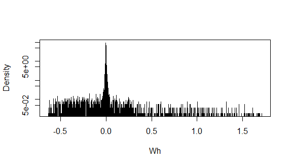

The figures presents the process for an appliance.

1. densitydata presents the log-density of the whole dataset

2. percentiledata presents the data repartition by percentiles

3. slopedata presents the log-density of the slope after cutting the dataset

4. elbow presents the Elbow method of a representative sample of the dataset

5. agnessil1 presents the Silhouette after the AGNES hcut

6. agnessil2 presents the Silhouette after merging the whole dataset

7. silkmeans presents the Silhouette after adjusting the data with KMEANS

8. diffAGNES-DIANA presents the difference between clusters of AGNES and DIANA

